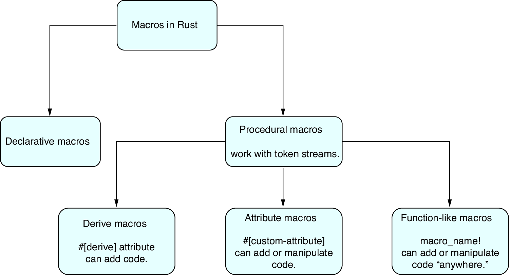

[Procedural Macros](https://doc.rust-lang.org/reference/procedural-macros.html)
- Derive macro: `#[proc_macro_derive(Hello)]`
- Attribute macro: `#[proc_macro_attribute]`
- Function-like macro: `#[proc_macro]`
